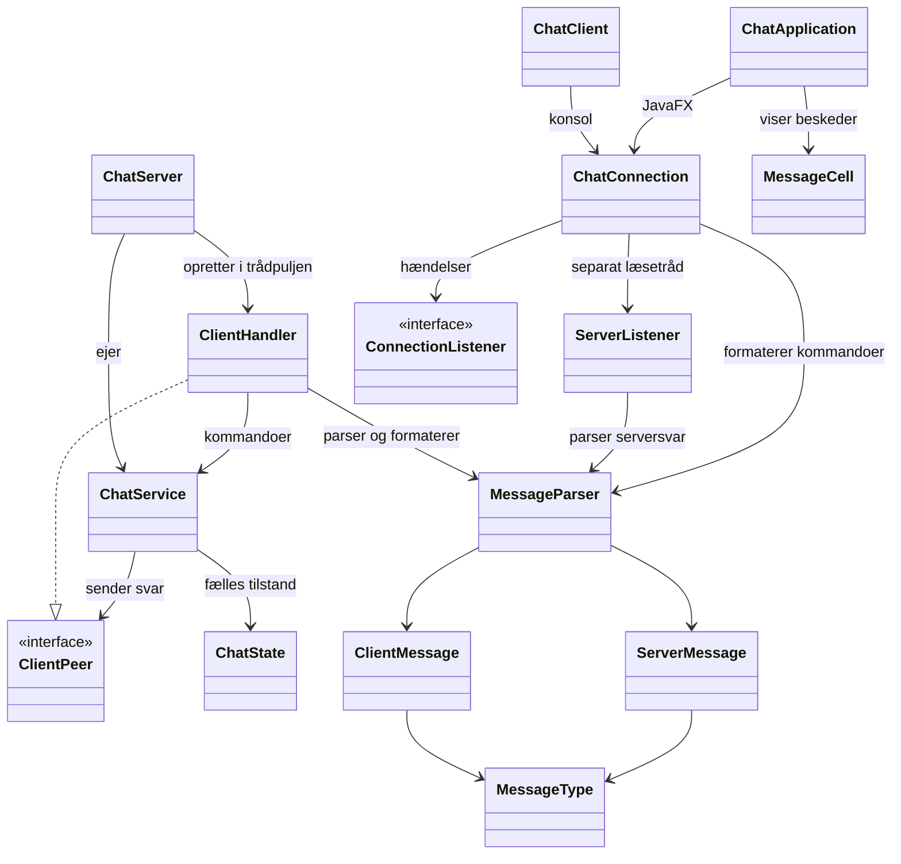
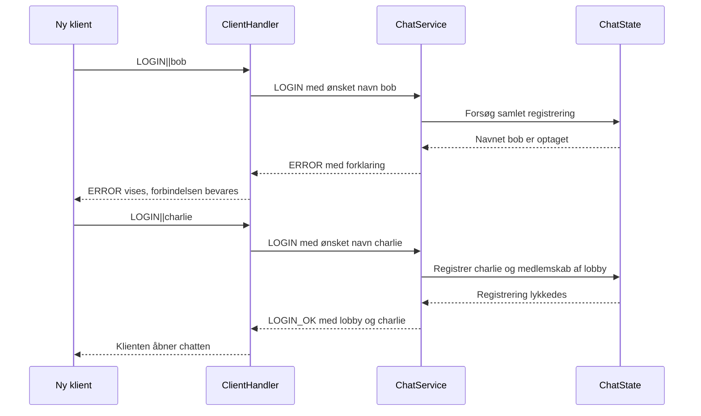

# Mini Chat

Et chatprogram i Java 21 med TCP-sockets, en fælles server, en konsolklient og en grafisk JavaFX-klient. Klienterne kan chatte sammen, skifte rum og sende private beskeder. Se [udviklingsplanen](PLAN.md).

Versioner: Java 21, JavaFX 21.0.12, JUnit Jupiter 6.1.3 og Maven 3.9.16 via projektets wrapper.

## Åbn i IntelliJ

1. Åbn projektets `pom.xml` som et Maven-projekt.
2. Vælg Java 21 som Project SDK og som JDK for Maven Runner.
3. Lad IntelliJ indlæse Maven-afhængighederne.
4. Start kørselskonfigurationen **ChatServer** og derefter **ChatClient**. Du kan også køre deres `main`-metoder direkte.
5. Start **ChatApplication (JavaFX)**. Alternativt bruges Maven-vinduet med målet `javafx:run` eller terminalkommandoen nedenfor.

Klientkonfigurationen tillader flere samtidige processer. Start tre klienter og vælg forskellige navne for at demonstrere samtidighed. Hvis IntelliJ foreslår at stoppe den eksisterende klient, aktivér **Allow multiple instances** i klientens kørselskonfiguration.

## Start fra terminalen

Du skal have JDK 21. Maven Wrapper henter Maven 3.9.16 og projektets afhængigheder ved første kørsel; det kræver internet. På Windows bruges `mvnw.cmd` i stedet for `./mvnw`.

På macOS kan JDK vælges med:

```sh
export JAVA_HOME=$(/usr/libexec/java_home -v 21)
```

Byg og kør alle automatiske tests:

```sh
./mvnw clean verify
```

Start serveren i sin egen terminal:

```sh
./mvnw compile exec:java -Dexec.mainClass=chat.server.ChatServer -Dexec.args="5555"
```

Start hver konsolklient i en ny terminal:

```sh
./mvnw compile exec:java -Dexec.mainClass=chat.client.console.ChatClient -Dexec.args="localhost 5555"
```

Start den grafiske klient:

```sh
./mvnw javafx:run
```

Efter kompilering kan server og konsol også startes uden Maven med henholdsvis `java -cp target/classes chat.server.ChatServer` og `java -cp target/classes chat.client.console.ChatClient`. Standardadressen er `localhost:5555`.

Serveren stoppes med Ctrl+C eller stop-knappen i IntelliJ. Afslut klienten med `/quit`, med GUI'ens afbryd-knap eller ved at lukke vinduet.

## Brug chatten

Et brugernavn er 1–20 tegn fra `a-z`, `0-9` og `_`. Store bogstaver normaliseres til små, så `Bob` og `bob` er samme navn. `server` er reserveret. Et optaget navn kan erstattes med et nyt forsøg på samme forbindelse.

Alle starter i `lobby`. De øvrige rum er `java` og `hygge`.

| Konsolinput | Handling |
| --- | --- |
| `Hej alle` | Send til alle i det aktuelle rum, inklusive dig selv. |
| `/join java` | Skift til `java` efter serverens bekræftelse. |
| `/msg alice Hej Alice` | Send privat til `alice`, også hvis hun er i et andet rum. |
| `/help` | Vis kommandoer og rum. |
| `/quit` | Afslut forbindelsen. |

JavaFX bruger samme netværkskode som konsollen. Loginvisningen har vært, port og brugernavn. Chatvisningen har rumvalg, beskeder og felter til offentlige og private beskeder. Der ventes på serverens bekræftelse, før login og rumskifte ændrer klientens tilstand. Serverfejl vises i brugerfladen.

## Protokol

UTF-8-tekst, én besked pr. linje. Klienten sender `TYPE|TARGET|PAYLOAD`. Serveren sender `TIMESTAMP|TYPE|SENDER|TARGET|PAYLOAD`.

| Fra klient | Eksempel | Betydning |
| --- | --- | --- |
| `LOGIN` | `LOGIN||bob` | Vælg brugernavn; kun før login. |
| `JOIN_ROOM` | `JOIN_ROOM|java|` | Skift til et eksisterende rum. |
| `TEXT` | `TEXT|lobby|Hej alle` | Send til eget aktuelle rum. |
| `PRIVATE` | `PRIVATE|alice|Hej Alice` | Send kun til den angivne onlinebruger. |
| `QUIT` | `QUIT||` | Afslut; også tilladt før login. |

| Fra server | Sender | Target | Payload |
| --- | --- | --- | --- |
| `LOGIN_OK` | `server` | Startrum | Godkendt brugernavn. |
| `ROOM_JOINED` | `server` | Nyt rum | Bekræftelse af rumskifte. |
| `TEXT` | Afsendernavn | Rum | Beskedtekst. |
| `PRIVATE` | Afsendernavn | Modtagernavn | Privat tekst; kun modtageren får denne type. |
| `INFO` | `server` | Brugernavn | Status, fx kvittering til en privat afsender. |
| `ERROR` | `server` | Brugernavn, tomt før login | Forklaring af fejlen. |
| `BYE` | `server` | Brugernavn, tomt før login | Bekræftelse på normal afslutning. |

Eksempel på serversvar: `2026-09-10 17:00:00|TEXT|bob|lobby|Hej alle`.

Serveren bestemmer afsender og tidspunkt. Afsenderen udledes af forbindelsens godkendte login. Tiden bruger servercomputerens lokale tidszone og formatet `yyyy-MM-dd HH:mm:ss`; datoer parses strengt med `uuuu` i Java. Tidszonen er dermed den samme for alle beskeder fra den aktuelle server.

Parseren bruger `split("\\|", 3)` og `split("\\|", 5)`. Det bevarer tomme slutfelter og `|` i payload. Linjeskift er ikke tilladt inde i felter. Tom beskedtekst, ukendt type, manglende felter, forkert retning og ulovlige felter afvises. Serveren kræver desuden login, et ledigt navn, gyldigt rum og en online privat modtager. Et afvist rumskifte ændrer ikke medlemskabet.

## Klasser og dataflow



`ChatServer` accepterer forbindelser. `ClientHandler` ejer socket-I/O for én klient. `ChatService` udfører kommandoerne, mens `ChatState` holder styr på forbindelser, navne og rum. Registrene er samlet i én klasse for at kunne ændre relaterede data under samme lås.

`ChatConnection` og `ServerListener` er fælles for begge klienttyper. `ConnectionListener` leverer hændelser, som konsollen udskriver, og JavaFX viser i vinduet. Netværkskoden kender ingen GUI-kontroller. `ClientPeer` gør serverlogikken testbar med modtagere i hukommelsen.

## Tråde og delte ressourcer

Serverens accepttråd tager imod sockets. En fast `ExecutorService` har plads til ti samtidige handlers; kapacitetskontrollen tæller også forbindelser før login. En ekstra forbindelse får en fejl og lukkes.

Alle bruger- og rumdata læses og ændres under én fælles lås i `ChatState`. Kontrol af et navn og registrering sker samlet. Et rumskifte ændrer gammelt medlemskab, nyt medlemskab og brugerens aktuelle rum samlet. Samlingerne er private; kaldere får kopier af modtagerlisterne.

Socket-skrivning sker efter frigivelse af tilstandslåsen. Hver forbindelse har sin egen sendelås, så to handlers ikke kan blande deres protokollinjer. Socketlukning kræver ikke sendelåsen, så en blokerende skrivning kan afbrydes. `QUIT`, EOF og I/O-fejl leder til samme idempotente oprydning af den konkrete forbindelse. En gammel handler kan ikke fjerne et senere login med samme navn.

På klienten er modtagelse adskilt fra afsendelse og brugerinput. JavaFX får hændelser via `Platform.runLater`, og forbindelsesforsøg/afsendelse udføres i baggrunden. Konsolinput må ikke holde klientprocessen i live, efter serveren er stoppet.

Klienterne har én egen kommando af gangen under behandling: login afventer `LOGIN_OK`, rumskifte afventer `ROOM_JOINED`, offentlig tekst afventer eget `TEXT`-echo, og privat tekst afventer `INFO`. Et `ERROR` gælder dermed den aktuelle kommando. Andre brugeres beskeder modtages og vises samtidig. Det undgår at forveksle svar uden at udvide opgavens protokol med request-id'er.

## Eksempel: optaget brugernavn



## Test, AI og afgrænsning

Se [testresultater og demonstrationsforløb](docs/TESTS.md) samt [AI-dokumentation](docs/AI.md). Automatiske tests køres med `./mvnw test`; `./mvnw clean verify` kontrollerer også en ren kompilering.

JavaFX er den valgte udvidelse. Den skal demonstreres sammen med konsolklienten, så genbruget af protokol og netværkskode er synligt.

Data gemmes kun i hukommelsen. Der er højst ti samtidige forbindelser, ingen adgangskoder, vedvarende historik eller automatisk genforbindelse. TCP opdager et forbindelsesbrud ved læsning/skrivning; der er ingen heartbeat-protokol. Langsomme modtagere kan forsinke de handlers, der sender til dem, men holder ikke låsen til serverens brugerregistre.

Modtagere vælges ud fra medlemskab, når serveren accepterer beskeden. En besked fra det gamle rum kan allerede være undervejs under et rumskifte; derfor mærkes offentlige beskeder med deres rum. Der loves ikke en global rækkefølge for samtidige afsendere eller en kvittering for, at en privat besked er læst.
